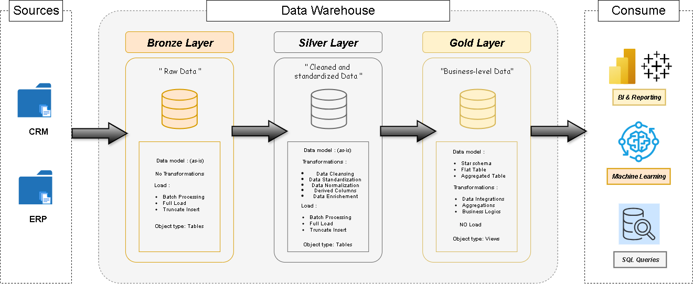

# SQL Data Warehouse – Medallion Architecture

## Overview
This repository demonstrates a modern data warehouse implementation using the Medallion Architecture (Bronze, Silver, Gold layers) . It is designed for scalable, maintainable, and high-quality analytics, following best practices in data engineering.

## Architecture: Medallion Layers

- **Bronze Layer:** Raw ingestion from CRM and ERP sources. Minimal transformation, schema enforcement.
- **Silver Layer:** Cleansed, conformed, and joined data. Business logic and deduplication applied.
- **Gold Layer:** Aggregated, business-ready datasets for analytics and reporting.

Refer to `docs/data_model.png` and `docs/data_flow.png` for detailed models and data flow.

## Datasets
Located in `datasets/`:

- **source_crm/**
	- `cust_info.csv`: Customer master data
	- `prd_info.csv`: Product master data
	- `sales_details.csv`: CRM sales transactions
- **source_erp/**
	- `CUST_AZ12.csv`: ERP customer data
	- `LOC_A101.csv`: Location master data
	- `PX_CAT_G1V2.csv`: Product category mapping

## Scripts & ETL
Located in `scripts/`:

- `init_db.sql`: Initializes SQL Server database and schemas
- `bronze/`: DDL and procedures for raw ingestion
- `silver/`: DDL and procedures for cleansing, joining, and business logic
- `gold/`: DDL for analytics-ready tables

Refer to `tests/` for data quality checks:
- `data_quality_silver.sql`: Validates Silver layer
- `data_quality_gold.sql`: Validates Gold layer

## Usage

### 1. Database Initialization
Run `scripts/init_db.sql` to set up schemas and base tables.

### 2. Ingest Data (Bronze)
Use scripts in `scripts/bronze/` to load raw CSVs into staging tables.

### 3. Transform & Cleanse (Silver)
Execute procedures in `scripts/silver/` to clean, deduplicate, and join data.

### 4. Aggregate & Serve (Gold)
Run DDL in `scripts/gold/` to create business-ready tables.

### 5. Data Quality
Run tests in `tests/` to validate data integrity and business rules.

## Documentation
- [Data Catalog](docs/data_catalog.md): Table and column definitions
- [Naming Convention](docs/naming_convention.md): Standards for tables, columns, and procedures
- Architecture diagrams in `docs/`

## License
See [LICENSE](LICENSE) for usage terms.

## Contact
For questions or contributions, open an issue or contact me.
